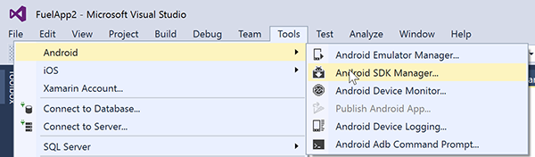
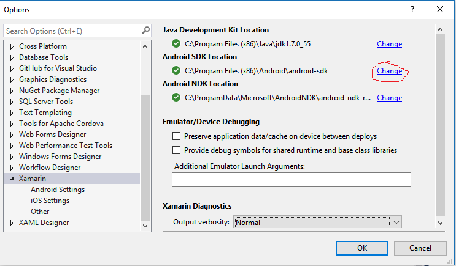
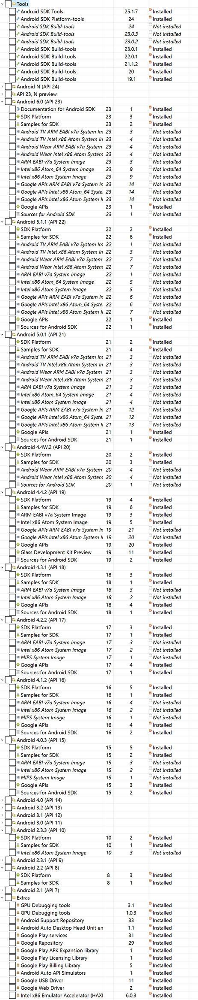
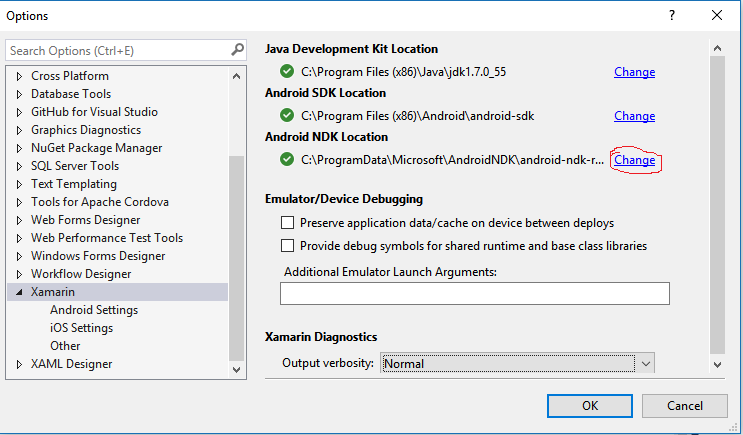
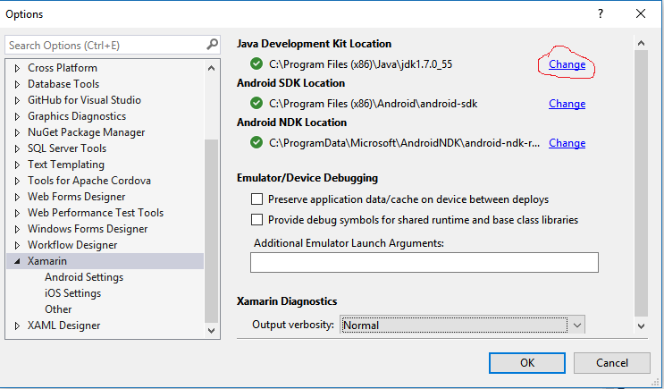
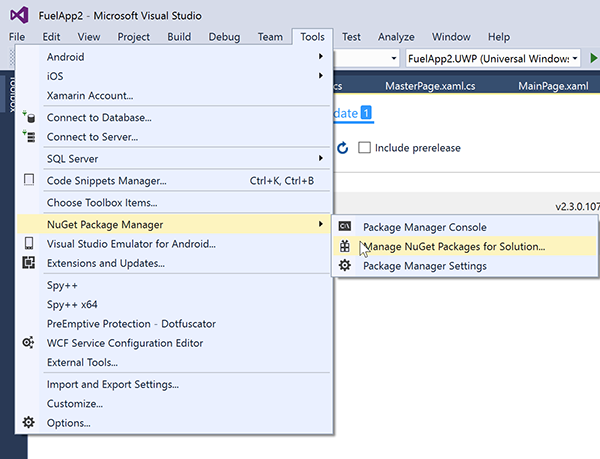

# WAEC LAGOS
Xamarin Engage kaduna Visual Studio Installation

Installing Visual Studio is not enough.... 
There is another 2 hours plus of downloading and installing to get to your first successful Xamarin hello world app.

Step 1
Install VS 2015 + the Xamarin extension:   (if you have a better Internet)
 https://aka.ms/xamarindevdays/
 
(No Internet )
Install the Visual Studio ISO From the Folder and make sure your Internet is Disconnected during this Process

Figure: You need "C#/.NET (Xamarin v4.1.0)
Note: Xamarin Studio doesn't exist on the PC anymore.

step 2 :

install Xamarin.Visualstudio MSI File

Step 3 - Android SDK Manager (about 2 hours)
This one is painful... 
but if you have the Xamarin Engage Folder its called Android SDK

Extract the SDk from  file to your C Drive "C:\Program Files (x86)\Android" 
Manually Identify your SDK Path on Visual Studio
on Visual studio tools>> Options >> Xamarin

After installing the SDK, some additional components need to be installed via the Android SDK Manager. Check to install at least:

Android SDK Tools
Android SDK Platform-Tools
Android SDK Build-Tools
One (or more) Android Platforms (such as 4.1 / API 16 in the screenshot below).
and click "Install" to install.
Then get all the ones that say "Installed" :

Step 4;
Android Native Development Kit (NDK)

Extract NDK to "C:\Program Files (x86)\Android\android-ndk-r10e"
Install the Android Native Development Kit 
but if you have the Xamarin Engage Folder its called Android NDK
Manually Identify your NDK Path on Visual Studio
on Visual studio tools>> Options >> Xamarin

Step 4 - 
Install the Java Development Kit
but if you have the Xamarin Engage Folder its called JDK
install the file.

Manually Identify your Java Path on Visual Studio
on Visual studio tools>> Options >> Xamarin

Step 3 - 
"Manage NuGet Packages for Solution" (about 30 minutes)  (This step needs internet)
Create a Blank App (xamarin.Forms Portable) project (this way it will trigger grabbing all extra stuff).
Check and ensure Nuget Packages are up to date .

Step 4 
Run the app on an Emulator ( Make sure you have installed the Android Emulator in the XE Folder)
Actually run the application you’ve created. Ensure it builds. It won't always run well the first time it often won't, if it does then congratulations you have got everything!
